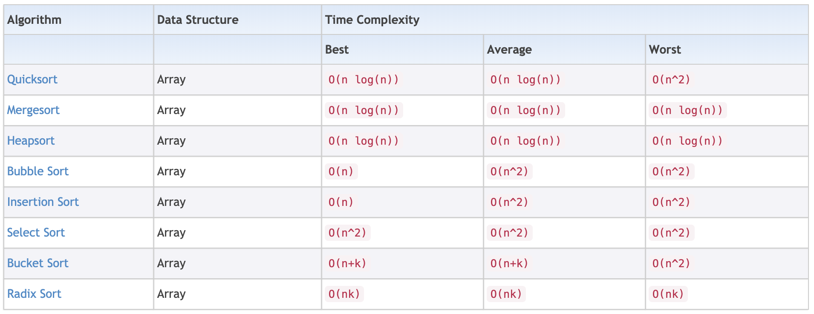

### 148-SortList

+ [Question](https://leetcode-cn.com/problems/sort-list/): sort a single linkedlist with O(nlogn) time and O(1) space
+ Analysis:



​	O(nlogn) time：`Quicksort`、`Mergesort`、`Heapsort`

​	O(1) space as linkedlist：`Quicksort`、`Mergesort`

+ Solution-1：Quicksort (==Time Limit Exceed==, but I don't know why)

```python
# Definition for singly-linked list.
# class ListNode(object):
#     def __init__(self, x):
#         self.val = x
#         self.next = None

class Solution(object):
    def sortList(self, head):
        """
        :type head: ListNode
        :rtype: ListNode
        """
        if head is None or head.next is None: return head
        self.quickSort(head, None)

        return head

    def quickSort(self, pBegin, pEnd):
        if pBegin == pEnd or pBegin.next == pEnd: return
        pMid = self.partition(pBegin, pEnd)
        self.quickSort(pBegin, pMid)
        self.quickSort(pMid.next, pEnd)

    def partition(self, pBegin, pEnd):
        pivotVal = pBegin.val
        p = q = pBegin
        while q != pEnd:
            if q.val < pivotVal:
                p = p.next
                p.val, q.val = q.val, p.val
            q = q.next
        pBegin.val, p.val = p.val, pBegin.val
        return p
```

+ Solution-2：Mergesort

```python
# Definition for singly-linked list.
# class ListNode(object):
#     def __init__(self, x):
#         self.val = x
#         self.next = None

class Solution(object):
    def sortList(self, head):
        """
        :type head: ListNode
        :rtype: ListNode
        """
        return self.mergeSort(head)
        
    def mergeSort(self, head):
        if head is None or head.next is None: return head
        head1 = head
        head2 = self.getMid(head)
        head1 = self.mergeSort(head1)
        head2 = self.mergeSort(head2)
        return self.merge(head1, head2)

    def getMid(self, head):
        pFast = head.next
        pSlow = head.next
        pre = head
        while True:
            if pFast is None: break
            pFast = pFast.next
            if pFast is None: break
            pFast = pFast.next
            pre = pSlow
            pSlow = pSlow.next
        pre.next = None
        return pSlow

    def merge(self, head1, head2):
        newHead = ListNode(-1)
        newTail = newHead
        while head1 is not None and head2 is not None:
            if head1.val <= head2.val:
                newTail.next = head1
                head1 = head1.next
            else:
                newTail.next = head2
                head2 = head2.next
            newTail = newTail.next
            newTail.next = None
        if head1 is not None:
            newTail.next = head1
        if head2 is not None:
            newTail.next = head2
        return newHead.next
```

